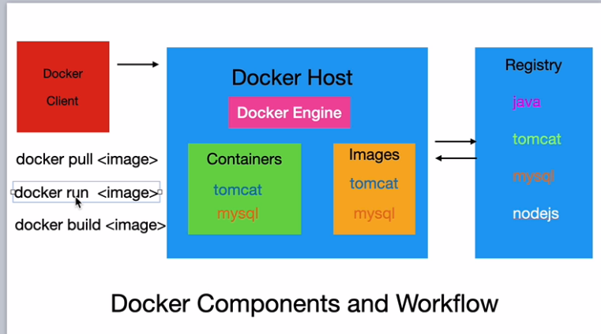

# Docker
Docker is an open source platform that enables developers to build, deploy, run, update and manage containers—standardized, executable components that combine application source code with the operating system (OS) libraries and dependencies required to run that code in any environment.

The container is a sandboxed process (an isolated testing environment that enables users to run programs or open files without affecting the application, system or platform on which they run) on a machine that is isolated from all other process on the host machine.

- **Container Image**
When running container, it uses a isolated filessystem. This custom filesystem is provided by container image. since the image contain the container filesystem, it must contain everything needed to run an application. ie all dependencies, configuration, scripts, binaries etc. The image also contain other configuration for a container such as environment variable, a default command to run and ither metadata.  

Installation and practice

    sudo apt-get update
 
    
    sudo apt-get install -y docker.io
 
      
    docker -v
 

    sudo docker info
 
start the docker daemon

    sudo service docker start

 
For docker images
    docker compose run imagename (images name as in dockor-compose.yml file)
    sudo docker images
    sudo docker rmi image_id (removes image only if its container is deleted)
 
For docker Container details

    sudo docker ps -a
 
To stop or delete container
    
    sudo docker start container_id/container_name
    sudo docker stop container_id
    sudo docker rm container_id
    sudo docker rm -f container_id (forcefully removed the container)
    sudo docker ps
    
    
 
It will pull the hello-world image and if it is not there, then run the container.

    sudo docker run hello-world
 
It will pull the latest images of docker container and lunch the container. The if we do ls then we find out that we are inside the ununtu os running on a docker container.

    sudo docker run -it ubuntu
    sudo docker run --dit --name=containername ubuntu (assign own name to container rather than default)
 

    history
    
- **Docker run**

Docker run command is used to do following things: 
  - Create a new container if it does not exist 
  - Run a newly created or previously created container from the image provided 
  
You need to have an image first in order to run this command. If you do not have an image it does following things: 
  - Try to find docker image locally 
  - If image is not found it tries to find image on Docker hub 
  - If it finds the image it downloads it store in the image cache 
  - Creates a container from the downloaded or local image 
  - If image can not be found on local or on docker hub it gives you no error and does nothing
  
 # Map a Host port to a Container Port
 The Container port 80 can be access on port 8001 on host machine.
  
    sudo docker run -i -d -t -p 8001:80 nginx
    sudo docker run -itd nginx (without port mapping)
  
 
 We can also creates a image from a docker container ID using commit method,That new image will run on new Docker container.
  
 
    sudo docker commit container_id imagename
    sodo docker images
    sudo docker run -dit --name=myimagename imagename
    sudo docker ps
 

 
In above image, the images are pulled the docker images from the docker hub onto the local machine. Then run those images using docker run command, which will lunch the container in the local machine.

# Pull Database
 
Postgres db
    
    psql -U username -d databasename -W
 

   - mongodb
 
    
    sudo docker pull mongo:5.0.9
    sudo docker run -dit -p 27017:27017 --name=test-mongo mongo
    sudo docker run -dit -p 27017:27017 --name=test-mongo --env="MONGO_PASS=test123" --env="MONGO_USER=root" mongo
    sudo docker run -dit -p 27017:27017 --name=test-mongo --env="MONGO_PASS=test123" --env="MONGO_USER=root" -v ~/folderonmachaine:/var/lib/mongodb/data mongo
    sudo docker exec -it name bash or docker compose exec name sh
    mongo mongosh

 # Bind Mount and Volume
 
 When we lunch a container, it store some data inside the container, our application needs these data. and if we stop the container we still have that data and if we delete container or relunch the another container from same image then the data will no longer available. That's why the concept of bind mount and volume came.This concepts helps to persist that data on host machine even after container is deleted. Bind mound will use any folder on host machine to store a data but Volume are created by docker command and inside folder /var/lib/docker/volumes docker maintain this by itself.
 
 
 
# Run a django project on Docker Compose UP
First we have a Dockerfile and docker-compose.yml file. after that ,
 

    dockor compose up
    
    
    
